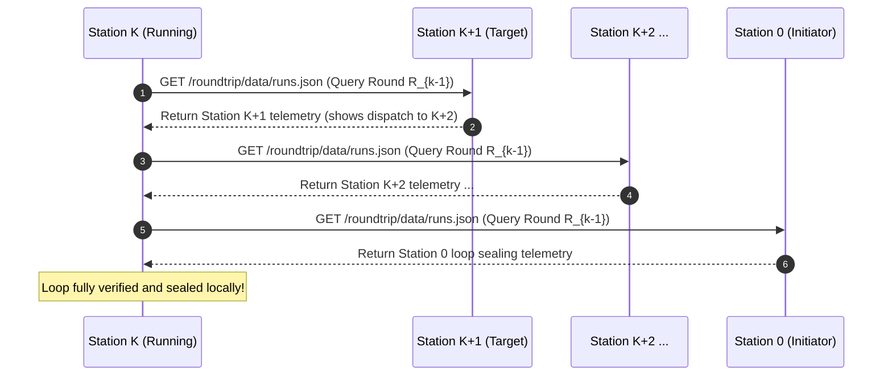

# Database Schema & Run Reconstruction

## 1. Storage Location & Philosophy

Each station persists its telemetry in `data/runs.json`. Because each station serves its frontend via GitHub Pages, `data/runs.json` is publicly fetchable via:

$$\text{https://}\{\text{owner}\}\text{.github.io/roundtrip/data/runs.json}$$

This enables any station or external observer to audit station logs and reconstruct complete historical loops.

---

## 2. Schema Specification (`data/runs.json`)

```json
{
  "$schema": "https://json-schema.org/draft/2020-12/schema",
  "version": "1.0.0",
  "station_id": "kreier-sg-01",
  "runs": [
    {
      "round_id": "RT-2026-10-03-314",
      "status": "COMPLETED",
      "initiator": {
        "station_id": "kreier-station-0",
        "repo": "kreier/roundtrip",
        "scheduled_time_utc": "2026-10-03T03:14:00.000Z",
        "actual_start_utc": "2026-10-03T03:14:42.185Z",
        "cron_jitter_ms": 42185
      },
      "summary": {
        "total_roundtrip_ms": 194820,
        "stations_count": 3,
        "round_completed_at_utc": "2026-10-03T03:17:57.005Z"
      },
      "stations": [
        {
          "sequence": 0,
          "station_id": "kreier-station-0",
          "repo": "kreier/roundtrip",
          "received_at_utc": "2026-10-03T03:14:42.185Z",
          "workflow_started_at_utc": "2026-10-03T03:14:45.320Z",
          "deploy_completed_at_utc": "2026-10-03T03:15:26.500Z",
          "dispatched_next_at_utc": "2026-10-03T03:15:30.410Z",
          "metrics": {
            "queue_delay_ms": 3135,
            "execution_ms": 41180,
            "deploy_ms": 28420,
            "dispatch_out_ms": 3910
          }
        },
        {
          "sequence": 1,
          "station_id": "offspring-station-1",
          "repo": "offspring26/roundtrip",
          "received_at_utc": "2026-10-03T03:15:32.200Z",
          "workflow_started_at_utc": "2026-10-03T03:15:36.110Z",
          "deploy_completed_at_utc": "2026-10-03T03:16:21.800Z",
          "dispatched_next_at_utc": "2026-10-03T03:16:25.400Z",
          "metrics": {
            "queue_delay_ms": 3910,
            "execution_ms": 45690,
            "deploy_ms": 29810,
            "dispatch_out_ms": 3600,
            "network_transit_ms": 1790
          }
        }
      ]
    }
  ]
}
```

---

## 3. Prior Round Reconstruction Algorithm

Before a station dispatches the signal forward in round $R_k$, it audits and reconstructs the full cycle of the preceding round $R_{k-1}$.



### Algorithm Steps:
1. **Identify Target Round**: Let $R_{k-1}$ be the previous round ID. If this is the initial execution ($R_0$), reconstruction is marked `INITIAL_RUN` and skipped.
2. **Follow the Forward Pointer**:
   - The current station queries the downstream station's public endpoint:
     `https://{next_station_repo_owner}.github.io/roundtrip/data/runs.json`.
   - Locates entry for $R_{k-1}$.
   - Extracts:
     - $T_{\text{start}}$: When the next station began execution.
     - $T_{\text{finish}}$: When the next station completed deployment.
     - $T_{\text{next\_dispatch}}$: When the next station dispatched its downstream peer.
     - $\text{target}_{\text{downstream}}$: The repository the next station dispatched.
3. **Trace the Loop Back to Initiator and Self**:
   - Recursively fetch each successive station's `data/runs.json` until reaching the Initiator, and continuing from the Initiator back to the current station.
4. **Detect Broken Loops**:
   - If any station in the sequence timed out, never ran, or failed to deploy, the loop is flagged as `BROKEN_LOOP` at node $X$.
   - The broken trace, last known timestamps, and failure point are committed into `data/runs.json`.
