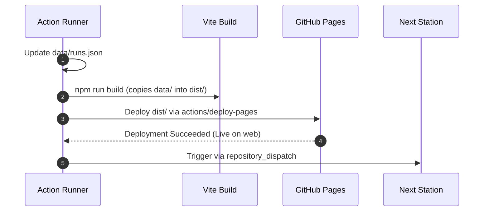

# Frontend Dashboard & Gantt Chart Visualizer

## 1. Overview

Each station in the Roundtrip ring hosts an interactive web dashboard via **GitHub Pages**, built using **Vite + React + TypeScript**.

The dashboard provides visual telemetry on current and historical rounds, featuring:
1. **Interactive Gantt Chart**: Showing precise phase breakdowns (queue delay, run duration, Pages deploy duration, and inter-station network transit) across all stations in the ring.
2. **Ring Topology Map**: An interactive circular node diagram showing the propagation route, current active station, and network health.
3. **Loop Reconstruction Inspector**: A drill-down view showing the verified hop trace from the next station back to Station 0 and to itself.

---

## 2. Gantt Chart Visual Breakdown

The Gantt chart decomposes each station's execution into five discrete, color-coded phases:

```
Station 0 (Initiator)
[ Scheduler Jitter ] [ Runner Setup & Exec ] [ Vite Build & Pages Deploy ] [ App Token & Dispatch ]
                                                                           ↳ Dispatch Out
Station 1 (Relay)
                   [ Network / Queue ] [ Setup & Exec ] [ Build & Pages Deploy ] [ Dispatch ]
                                                                                 ↳ Dispatch Out
Station 2 (Relay)
                                     [ Network / Queue ] [ Exec ] [ Pages Deploy ] [ Dispatch ]
                                                                                   ↳ Completed!
```

### Color Palette & Phase Mapping:
- **Scheduler Jitter / Transit Delay** (Amber `#F59E0B`): Time between theoretical trigger and runner start.
- **Workflow Setup & Execution** (Sky Blue `#0284C7`): Python/script telemetry recording and round reconstruction.
- **Pages Build & Deploy** (Emerald `#10B981`): Vite compilation and deployment to GitHub Pages.
- **Dispatch Out** (Purple `#8B5CF6`): GitHub App token generation and `repository_dispatch` POST.
- **Broken Link / Error** (Rose `#E11D48`): Station failure, timeout, or missing hop.

---

## 3. Technology Stack

- **Framework**: React 18 / 19 with TypeScript
- **Bundler & Dev Server**: Vite
- **Styling**: Tailwind CSS
- **Icons**: Lucide React
- **Timeline / Charting**: Custom SVG / Canvas Gantt renderer for zero bloat and high responsiveness
- **Deployment**: `actions/deploy-pages` on GitHub Pages

---

## 4. Build & Deployment Lifecycle

To guarantee data consistency, each station's workflow enforces the following order:



> [!IMPORTANT]
> Step 5 (Trigger Next Station) must **never** execute before Step 4 (Pages Deployment) succeeds. This ensures that when the next station audits the ring, all preceding stations' endpoints are already serving the latest telemetry.
